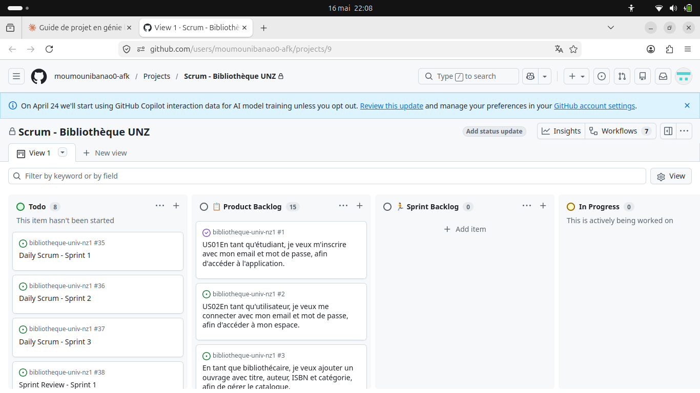
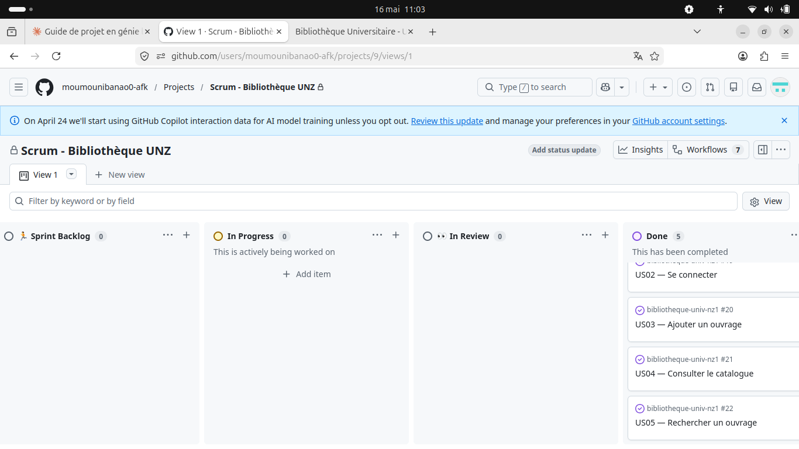
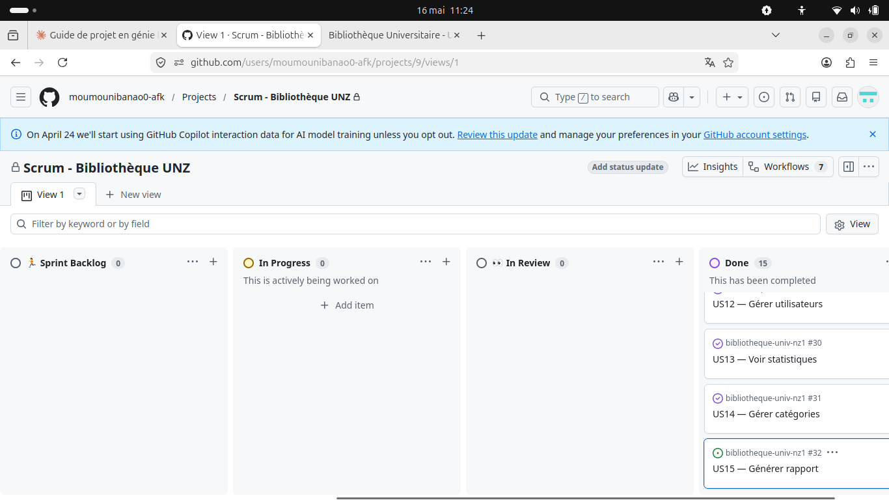
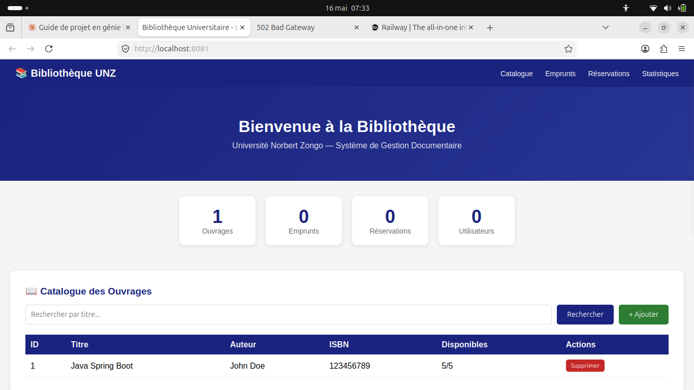
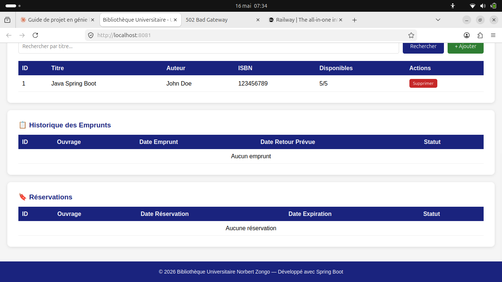
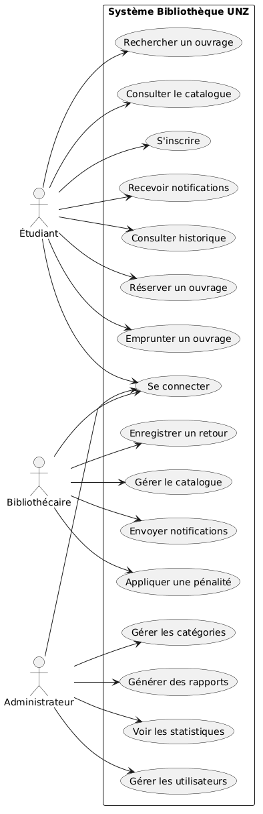
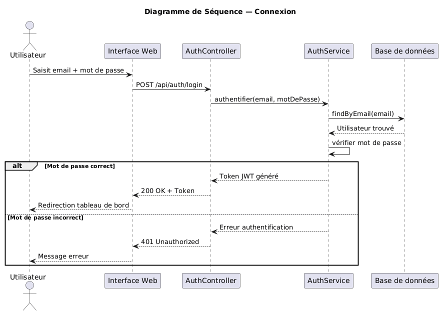
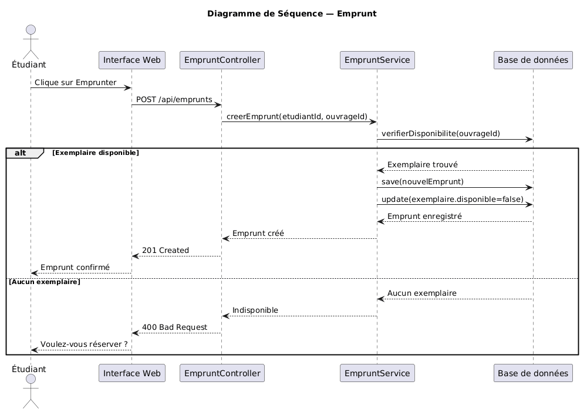
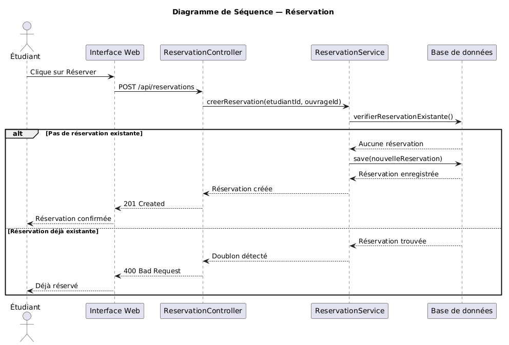
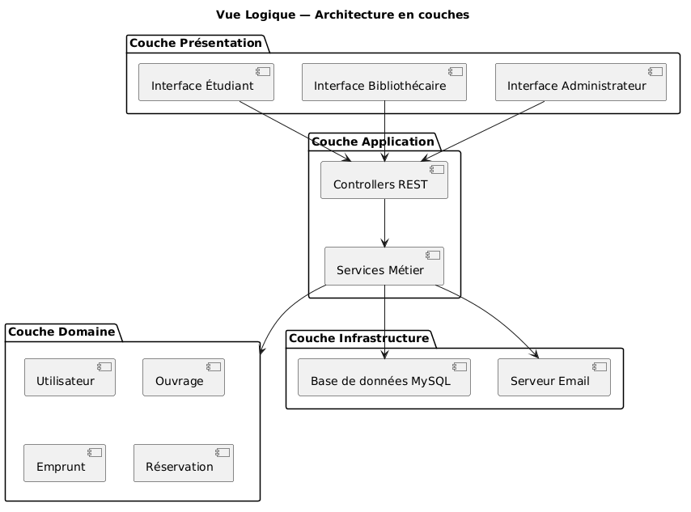

# Gestion Agile — Captures des outils

## 1. Tableau Kanban — GitHub Projects

Le tableau Kanban a été configuré avec 5 colonnes :
Product Backlog, Sprint Backlog, In Progress, In Review, Done.

## 2. Product Backlog — 15 User Stories

Le Product Backlog contient les 15 User Stories priorisées
par le Product Owner.

## 3. Done — 15 User Stories complétées

Les 15 User Stories ont été complétées en 3 sprints.

## 4. Interface Web de l'application

## 5. Diagrammes UML

### Diagramme de Cas d'Utilisation

### Diagramme de Séquence — Connexion

### Diagramme de Séquence — Emprunt

### Diagramme de Séquence — Réservation

### Vue Logique

